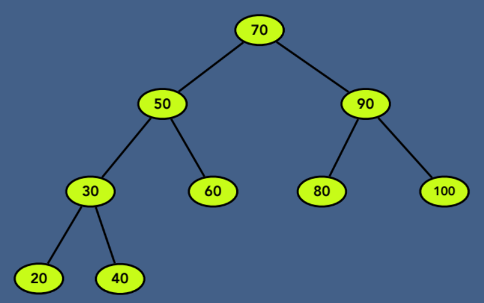

# Binary Search Tree 

### 1. 2진 탐색 트리
- 이진 탐색 트리(Binary Search Tree)는 이진 트리의 한 종류로, 각 노드에 키가 저장되어 있으며 다음과 같은 성질을 만족한다.
    - 왼쪽 서브트리에 있는 모든 노드의 키는 루트 노드의 키보다 작다.
    - 오른쪽 서브트리에 있는 모든 노드의 키는 루트 노드의 키보다 크다.
    - 왼쪽 서브트리와 오른쪽 서브트리도 이진 탐색 트리이다.

### 2. 이진 탐색 트리의 연산
1. Creation of BST
2. Insertion of a node
3. Deletion of a node
4. Search for a value
5. Traverse all nodes
6. Deletion of BST