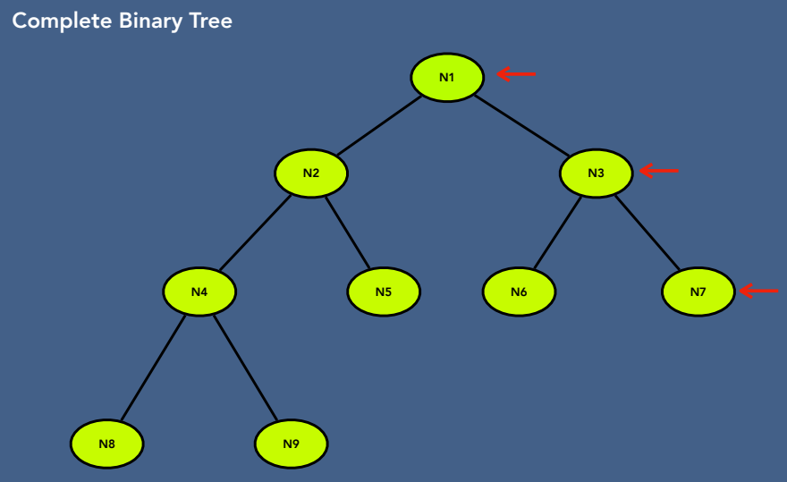

# Tree

#### 트리 구조 및 속성 

#### 트리 용어
- Root : 부모가 없는 최상위 노드
- Edge : 부모와 자식 사이의 링크
- Leaf : 자식이 없는 노드
- Sibling : 같은 부모의 자식
- Ancestor :  노드의 부모, 조부모, 증조부모
- Depth of node :  루트에서 노드까지의 경로 길이
- Height of node :  노드에서 가장 깊은 노드까지의 경로 길이
- Depth of tree : 루트 노드의 깊이
- Height of tree : 루트 노드의 높이

#### Binary Tree 의 종류

- BST, Heap tree, AVL, red black trees, Syntax tree
- Full binary tree : 완전 이진 트리: 모든 노드에 0개 또는 2개의 자식이 있음

- Complete binary tree : 완전 이진 트리: 모든 레벨이 마지막 레벨을 제외하고 완전히 채워지고 마지막 레벨에는 가능한 한 왼쪽에 모든 키가 있음

- Perfect binary tree : 완벽 이진 트리: 모든 내부 노드에 두 개의 자식이 있고 모든 리프가 같은 레벨에 있음

- Balanced binary tree : 균형 이진 트리: 트리의 높이는 O(log n)이고 여기서 n은 노드 수임

- Degenerate (or pathological) tree : 퇴화(또는 병리적) 트리: 각 부모 노드에 연관된 자식 노드가 하나만 있음
- Skewed binary tree : 비대칭 이진 트리: 트리의 높이가 O(n)인 퇴화 트리
- Height balanced binary tree : 높이 균형 이진 트리: 모든 노드의 두 서브트리의 깊이가 1 이상 차이가 나지 않는 이진 트리
- Weight balanced binary tree : 가중치 균형 이진 트리: 각 노드에 대해 왼쪽 서브 트리의 노드 수가 오른쪽 서브 트리의 노드 수의 최소 절반 이상, 최대 두 배인 이진 트리
- Complete binary search tree : 완전 이진 탐색 트리: 마지막 레벨을 제외한 모든 레벨이 완전히 채워지고 모든 노드가 가능한 한 왼쪽에 있는 이진 탐색 트리
- Full binary search tree : 완전 이진 탐색 트리: 모든 노드에 자식이 0개 또는 2개 있는 이진 탐색 트리
- Perfect binary search tree : 완전 이진 탐색 트리: 모든 내부 노드에 자식이 2개 있고 모든 리프가 같은 레벨에 있는 이진 탐색 트리
- AVL tree : AVL 트리: 모든 노드의 두 자식 서브 트리의 높이가 최대 1만큼 다른 자체 균형 이진 탐색 트리
- Red-black tree : 적색-흑색 트리: 각 노드에 노드의 색상을 나타내는 추가 비트가 있는 자체 균형 이진 탐색 트리(빨간색 또는 검정색)
- Syntax tree : 구문 트리: 형식 문법에 따라 언어 구성 요소의 구문 구조를 나타내는 트리
- Huffman tree : 허프만 트리: 트리의 각 리프가 주어진 알파벳의 문자에 해당하는 완전 이진 트리
- B-tree : B-트리: 정렬된 데이터를 유지하고 로그 시간 내에 검색, 순차적 액세스, 삽입 및 삭제를 허용하는 자체 균형 트리 데이터 구조
- B+ tree : B+ 트리: 각 내부 노드가 가변적인 수의 자식 노드를 가질 수 있지만 리프 노드는 B-트리와 동일한 트리 데이터 구조
- Splay tree : 스플레이 트리: 최근에 액세스한 요소에 빠르게 다시 액세스할 수 있는 추가 속성이 있는 자체 조정 이진 검색 트리
- Ternary tree : 삼진 트리: 각 노드가 최대 3개의 자식 노드를 갖는 트리 데이터 구조
- n-ary tree : n-ary 트리: 각 노드가 최대 n개의 자식 노드를 갖는 트리 데이터 구조